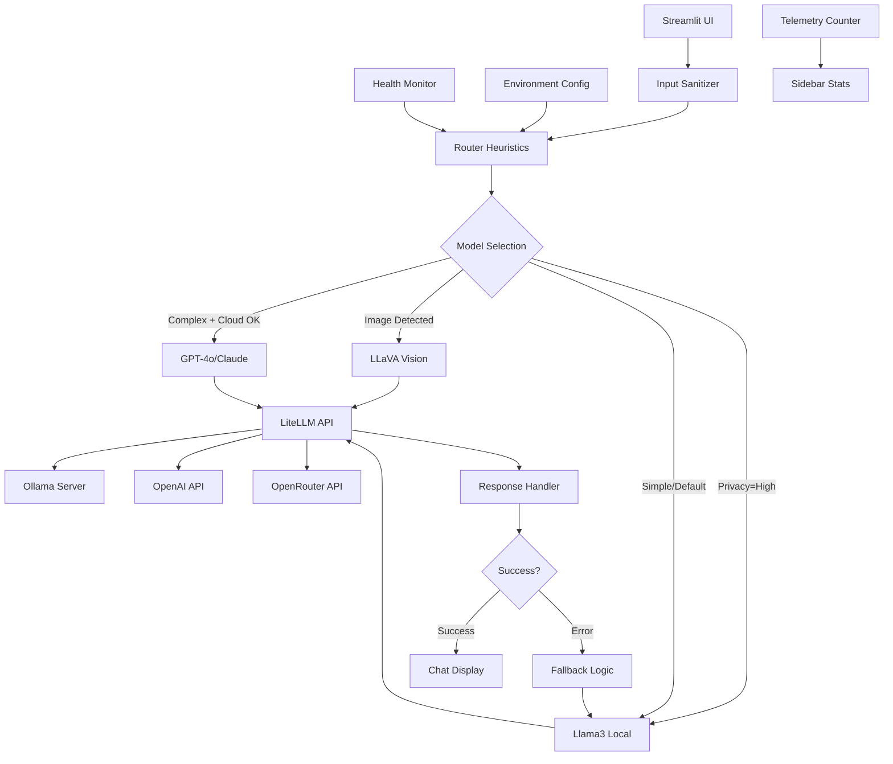

# 🤖 OmniAgent — Local-First, Multi-Modal AI Assistant

[](https://python.org)
[](https://streamlit.io)
[](https://ollama.ai)
[](https://ollama.ai)
[](LICENSE)

> **Privacy-first AI assistant that intelligently routes queries to optimal models — local for privacy, cloud for complexity.**

## 🎯 Why OmniAgent?

- **🔒 Privacy-First**: Local processing by default, with optional cloud enhancement
- **🧠 Multi-Modal**: Seamlessly handles text queries and image analysis
- **⚡ Smart Routing**: Deterministic model selection based on complexity and privacy settings
- **🛡️ Graceful Fallbacks**: Cloud-to-local fallback ensures reliability
- **📊 Production-Ready**: Complete with health checks, telemetry, and session management

Perfect for demonstrating modern AI orchestration, privacy-aware routing, and production deployment patterns.

### 🎥 Demo
[](https://github.com/spn1e/omni-agent/raw/master/assets/demo.mp4)

## 🚀 Features Matrix

| Feature | Status | Notes |
|---------|--------|-------|
| **Multi-Modal I/O** | ✅ | Text + Image inputs via Streamlit |
| **Privacy Toggle** | ✅ | High (local-only) / Normal (smart routing) |
| **Deterministic Routing** | ✅ | Rule-based model selection |
| **Health Checks** | ✅ | Real-time Ollama/OpenAI status monitoring |
| **Telemetry Counters** | ✅ | Track usage per model with fallback stats |
| **Cloud-to-Local Fallback** | ✅ | Automatic degradation with user notification |
| **Session Persistence** | ✅ | Chat history maintained during session |
| **Input Sanitization** | ✅ | Control char filtering + prompt injection guards |
| **Dark/Light Themes** | ✅ | Glassmorphism UI with smooth animations |
| **Export/Extensibility** | 🔄 | *Roadmap: Chat export, API endpoints* |

## 🏗️ Architecture



### Key Components
- **`app.py`**: Main Streamlit application with routing logic
- **Router**: `route_model()` - deterministic model selection
- **Sanitizer**: `sanitize_user_text()` - input safety and prompt injection guards
- **Health Monitor**: `get_env_status()` - real-time availability checks
- **Orchestration**: LiteLLM for unified model API calls

## 🎯 Routing Policy (Deterministic)

The system uses precise rules for model selection:

```python
# Exact routing logic from app.py
if has_image:
    return "ollama/llava"  # Always use vision model for images
elif privacy == "High":
    return "ollama/llama3:8b"  # Force local for high privacy
elif is_creative_or_complex(text) and env.openai_available:
    if api_key.startswith("sk-or-"):
        return "openrouter/anthropic/claude-3.5-sonnet"  # OpenRouter
    else:
        return "openai/gpt-4o"  # OpenAI
else:
    return "ollama/llama3:8b"  # Default local model
```

### Complexity Detection
Triggers cloud models when text has:
- **Length > 180 characters**, OR
- **Creative keywords**: write, create, design, generate, brainstorm, analyze
- **Multiple paragraphs** (line breaks)

### Examples by Route

| Input | Privacy | Route | Model |
|-------|---------|-------|-------|
| `"What is 2+2?"` | Normal | Simple | `ollama/llama3:8b` |
| `"Write a comprehensive analysis of renewable energy..."` | Normal | Complex | `openai/gpt-4o` |
| `[Image] + "What do you see?"` | Any | Vision | `ollama/llava` |
| `"Complex analysis task"` | High | Forced Local | `ollama/llama3:8b` |

### Fallback Behavior
- **GPT-4o quota exceeded** → Auto-fallback to `ollama/llama3:8b` with "(fallback to local)" annotation
- **Ollama unavailable** → Clear error message with setup instructions
- **All models fail** → System error with troubleshooting guidance

## 🛠️ Tech Stack

- **UI Framework**: Streamlit (web interface)
- **AI Orchestration**: LiteLLM (unified API for all model providers)
- **Local Models**: Ollama (`llama3:8b`, `llava`)
- **Cloud Models**: OpenAI GPT-4o, OpenRouter Claude 3.5 Sonnet
- **Image Processing**: PIL/Pillow (base64 encoding for vision models)
- **Environment**: python-dotenv (configuration management)
- **Health Monitoring**: requests (HTTP checks for Ollama)
- **Primary OS**: Windows 11 (with macOS/Linux compatibility)

## 🚀 Setup & Quickstart

### Prerequisites
- **Python 3.9+**
- **Ollama** installed and running (`ollama serve`)

### 1. Pull Required Models
```bash
ollama pull llama3:8b
ollama pull llava
```

### 2. Environment Setup
Copy environment template:
```bash
# Copy .env.example to .env (create manually if missing)
OPENAI_API_KEY=your-key-here  # Optional: enables GPT-4o
PRIVACY_DEFAULT=Normal        # or "High" for local-only
OLLAMA_BASE_URL=http://localhost:11434
LITELLM_TIMEOUT=60
LITELLM_LOG=info
```

### 3. Install & Run

**Windows (Recommended)**:
```powershell
python -m venv .venv
.\.venv\Scripts\activate
pip install -r requirements.txt
streamlit run app.py
```

**One-liner (Windows)**:
```powershell
.\run_win.ps1
```

**macOS/Linux**:
```bash
python -m venv .venv
source .venv/bin/activate
pip install -r requirements.txt
streamlit run app.py
```

### 4. Access Interface
Open browser to `http://localhost:8501`

## 📖 How to Use

### 🔧 Initial Setup
1. **Start Ollama**: Ensure `ollama serve` is running
2. **Launch App**: Run `streamlit run app.py`
3. **Check Sidebar**: Verify ✅ Ollama status and optional ✅ OpenAI status

### 💬 Text Conversations
- **Simple Query**: `"What is the capital of France?"` → 🦙 Llama3 (local)
- **Complex Query**: `"Analyze the economic impact of AI on job markets"` → 🌟 GPT-4o (cloud)
- **Creative Task**: `"Write a poem about quantum computing"` → 🌟 GPT-4o (cloud)

### 🖼️ Image Analysis
1. **Upload Image**: Use 📷 file uploader (PNG, JPG, JPEG)
2. **Ask Question**: `"What do you see in this image?"`
3. **Get Analysis**: Powered by 👁️ LLaVA vision model (local)

### 🔒 Privacy Controls
- **Sidebar Toggle**: Switch between "Normal" and "High Privacy" modes
- **High Privacy**: Forces all queries to local models only
- **Normal Mode**: Smart routing with cloud models for complex tasks

### 📊 Monitoring
- **Real-time Stats**: View model usage counters in sidebar
- **Health Status**: Monitor Ollama and OpenAI availability
- **Fallback Tracking**: See when cloud-to-local fallbacks occur

## ⚙️ Configuration

### Environment Variables
| Variable | Default | Purpose |
|----------|---------|---------|
| `OPENAI_API_KEY` | *none* | Enables GPT-4o access (supports OpenRouter `sk-or-` keys) |
| `PRIVACY_DEFAULT` | `Normal` | Default privacy mode (`High`\|`Normal`) |
| `OLLAMA_BASE_URL` | `http://localhost:11434` | Ollama server endpoint |
| `LITELLM_TIMEOUT` | `60` | Model call timeout (seconds) |
| `LITELLM_LOG` | `info` | Logging level (`debug` for verbose) |

### Model Configuration
The routing logic is centralized in `route_model()` function in `app.py`. Customize by modifying:
- **Complexity keywords** in `is_creative_or_complex()`
- **Model preferences** in `route_model()`
- **Fallback behavior** in `process_input()`

## 🔐 Security & Privacy

### Local-First Design
- **Default Privacy**: All processing local by default
- **High Privacy Mode**: Enforces local-only processing
- **Transparent Routing**: User sees which model handles each query

### Input Sanitization
```python
def sanitize_user_text(text: str) -> str:
    # Control character filtering
    # 4000 character limit
    # Basic prompt injection guards
    # Removes: "system:", "ignore previous", etc.
```

### Security Features
- **No remote file access**: Images processed locally only
- **Environment isolation**: API keys via `.env` (gitignored)
- **Input validation**: Length limits and content filtering
- **Error boundary**: Graceful handling of all failure modes

## ⚡ Performance & Observability

### Performance Targets
- **Local Response**: < 2 seconds (hardware dependent)
- **Cloud Response**: < 5 seconds (network dependent)
- **Fallback Speed**: < 1 second additional latency

### Monitoring Dashboard
Built-in sidebar provides:
- **Model Usage**: Request counts per model type
- **Health Status**: Real-time service availability
- **Fallback Rate**: Cloud-to-local fallback frequency
- **Local Processing %**: Privacy compliance metric

### Timeout Handling
- **Configurable timeouts**: Via `LITELLM_TIMEOUT`
- **Graceful degradation**: Clear error messages
- **Retry logic**: Automatic fallback on timeout

## 🐛 Troubleshooting

### Common Issues

**❌ Ollama: Unavailable**
```bash
# Ensure Ollama is running
ollama serve

# Verify models are pulled
ollama list
# Should show: llama3:8b, llava

# Test connection
curl http://localhost:11434/api/version
```

**❌ OpenAI: API key issues**
```bash
# Check .env file exists and contains key
cat .env | grep OPENAI_API_KEY

# Restart terminal after .env changes
# Key format: sk-... (OpenAI) or sk-or-... (OpenRouter)
```

**❌ Timeout errors**
```bash
# Increase timeout in .env
LITELLM_TIMEOUT=90

# Check system resources (Ollama needs RAM)
```

**❌ Streamlit cannot find .env**
```bash
# Ensure running from project root
cd /path/to/omniagent
streamlit run app.py

# Verify .env file location
ls -la .env
```

### Model-Specific Debugging
```bash
# Test individual components
python tests_routing.py  # Verify routing logic
python test_ollama.py    # Test Ollama connection
python test_env.py       # Verify environment variables
```

## 📁 Project Structure

```
.
├── app.py                   # Main Streamlit application
├── requirements.txt         # Python dependencies
├── .env.example            # Environment template
├── .env                    # Environment variables (not committed)
├── run_win.ps1             # Windows setup script
├── tests_routing.py        # Routing logic tests
├── setup.py                # Automated setup utility
├── test_ollama.py          # Ollama connectivity test
├── test_env.py             # Environment variable test
├── test_openrouter.py      # OpenRouter API test
├── .gitignore              # Git ignore rules
└── assets/
    ├── .gitkeep
    ├── demo.gif            # Usage demonstration
    └── screenshot.png      # Interface screenshot
```

## 🧪 Testing

Run the included test suite:
```bash
# Test routing logic
python tests_routing.py

# Expected output:
# ✅ ALL TESTS PASSED
# is_creative_or_complex: 9/9 tests passed
# route_model: 9/9 tests passed
```

### Test Coverage
- **Routing Logic**: Verifies model selection rules
- **Complexity Detection**: Tests creative/complex classification  
- **Environment Simulation**: Mocks various API availability states
- **Edge Cases**: Handles privacy modes and fallback scenarios

## 🗺️ Roadmap

### Short-term Enhancements
- **Chat Export**: Save conversations to markdown/JSON
- **Model Temperature Controls**: User-adjustable creativity settings
- **Custom System Prompts**: Persona/role customization
- **Batch Processing**: Multiple image analysis

### Medium-term Features
- **API Endpoints**: REST API for programmatic access
- **Plugin Architecture**: LangChain tool integration
- **Usage Dashboard**: Historical analytics and insights
- **Multi-language Support**: I18n for global users

### Long-term Vision
- **GPU Acceleration**: CUDA optimization for local models
- **Desktop App**: Electron wrapper for native experience
- **Docker Deployment**: Containerized production setup
- **Enterprise Features**: User management and audit logs


## 📄 License & Acknowledgments

**License**: MIT License

**Acknowledgments**:
- [Streamlit](https://streamlit.io) - Rapid web app development
- [Ollama](https://ollama.ai) - Local AI model hosting
- [LiteLLM](https://litellm.ai) - Unified AI model API
- [OpenAI](https://openai.com) - GPT-4o capabilities

---

## 🚀 Preview Your README

To see the formatted README:
1. **GitHub**: Push to repository and view on GitHub
2. **VS Code**: Install "Markdown Preview Enhanced" extension
3. **Browser**: Use [dillinger.io](https://dillinger.io) for live preview
4. **CLI**: Install `grip` (`pip install grip`) and run `grip README.md`


